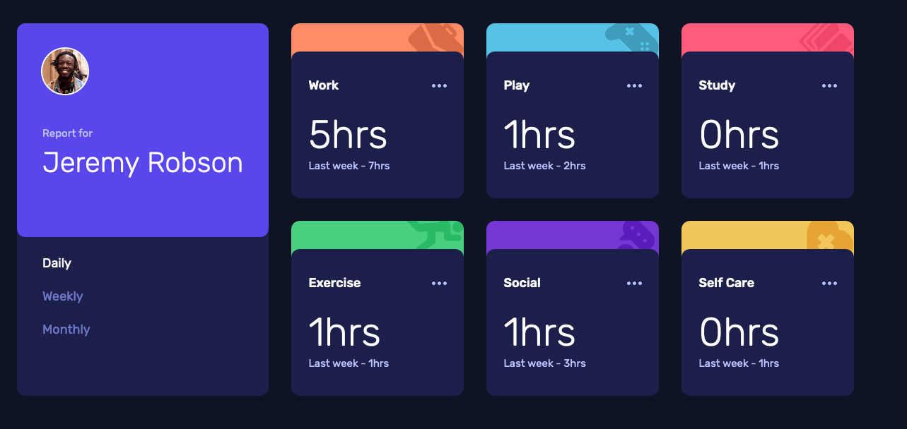
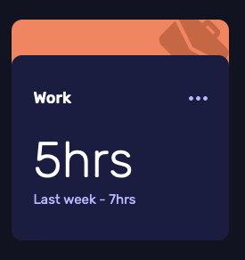

# Frontend Mentor - Time tracking dashboard solution

This is a solution to the [Time tracking dashboard challenge on Frontend Mentor](https://www.frontendmentor.io/challenges/time-tracking-dashboard-UIQ7167Jw).

## Table of contents

- [Overview](#overview)
    - [The challenge](#the-challenge)
    - [Screenshot](#screenshot)
    - [Links](#links)
- [My process](#my-process)
    - [Built with](#built-with)
    - [What I learned](#what-i-learned)
        - [Reading in JSON data](#reading-in-json-data)
        - [Dynamically reading local images](#dynamically-reading-local-images)
        - [Custom Fonts with ReactJS and Tailwindcss](#custom-fonts-with-reactjs-and-tailwindcss)
        - [Tabs](#tabs)
        - [Time Frame Card](#time-frame-card)
        - [Where to put Utility functions?](#where-to-put-utility-functions)
  - [Continued development](#continued-development)
    - [Useful resources](#useful-resources)
- [Author](#author)
- [Acknowledgments](#acknowledgments)

## Overview

### The challenge

Users should be able to:

- View the optimal layout for the site depending on their device's screen size
- See hover states for all interactive elements on the page
- Switch between viewing Daily, Weekly, and Monthly stats

### Screenshot

#### Desktop


#### Mobile


### Links

- Solution URL: [Github source code](https://github.com/notapatch/time_tracking_dashboard)
- Live Site URL: [aws amplify url](https://dev.d3jmxob2o1pg1m.amplifyapp.com)

## My process

### Built with

- CSS custom properties
- Flexbox
- CSS Grid
- Mobile-first workflow
- [React](https://reactjs.org/) - JS library
- [Tailwindcss](https://tailwindcss.com/docs) - For styles
- [HeadlessUI - tabs](https://headlessui.dev/react/tabs)
- No hardcoding. I put the user name into the JSON as well

### What I learned

Use this section to recap over some of your major learnings while working through this project. Writing these out and providing code samples of areas you want to highlight is a great way to reinforce your own knowledge.

### Reading in JSON data

The program has a JSON file to read and all that has to be done is import it.
Once imported I navigated through the data with properties and `map` which seems a common solution.

```
import TimeTracks from './data/timeTracks.json'
```

```jsx
import Report from './data/report.json'

function AnyFunction() {
  return (
    <>
      {Report.timeTracks.map(timeTrack => (
        <h2>{timeTrack.title}</h2>
      ))}
    </>
  );
}

export default App;
```

### Dynamically reading local images

I wanted to be able to add the name of the profile image to load in. The way ReactJS wants you to load in images is with import.
You can use require to do this but there is a bug that means that you must add default:

```js
require('./to/img/a.png')?.default
```

[There is no intention of fixing the bug.](https://github.com/facebook/create-react-app/pull/9934#issuecomment-851286168)
As they want to move to ES imports.

I'm going to hardcode the import which is fine for this toy application. I haven't investigated what's involved with using S3, say.


#### Reference

[Create React app - adding images fonts and files](https://create-react-app.dev/docs/adding-images-fonts-and-files/)

### Custom Fonts with ReactJS and Tailwindcss

Adding Custom font to Tailwindcss - I know of two ways that they have discussed are link into index.html head or using @font-face.
Meanwhile, adding a custom font to ReactJS seem to mainly discuss @import but there is a mention of link into the header.

Given that "link" is common between Tailwindcss and ReactJS I chose this and, it worked.

### Tabs

The biggest part of the application were the tabs. I used HeadlessUI tabs - I had rolled my own for my interest but it
would have doubled the size of the code. [So I used the Headless library code](https://headlessui.dev/react/tabs). 

The largest restriction I had was keeping the tab headers and content with a common parent element - which was solved with Flexbox.

### Time Frame Card



I originally, tried to solve this by getting one div on top of the other. This was tricky because where the rounding of the
edges happens you get a bleed through of the color on the bottom panel. If you reduce the height of the panel both panels
loose height. The simplest way ended up with two divs as siblings and then apply a negative margin on the "front" panel
to lay it over the colored div.

### Where to put Utility functions?

Commonly used files that don't fit into the component / file you are writing goes into Utils
or helper functions. Common structures are "utils" directory with one function per file
or files with common functions. In this example I had a function classNames that allows the
developer to conditionally joining css class names together.


### Continued development

ReactJS!

### Useful resources

- [Think in React](https://reactjs.org/docs/thinking-in-react.html) - Helpful to get basic structure of ReactJS app.
- [Tutorial: Intro into React](https://reactjs.org/tutorial/tutorial.html) - Gets you going.

## Author

- Frontend Mentor - [@notapatch](https://www.frontendmentor.io/profile/notapatch)